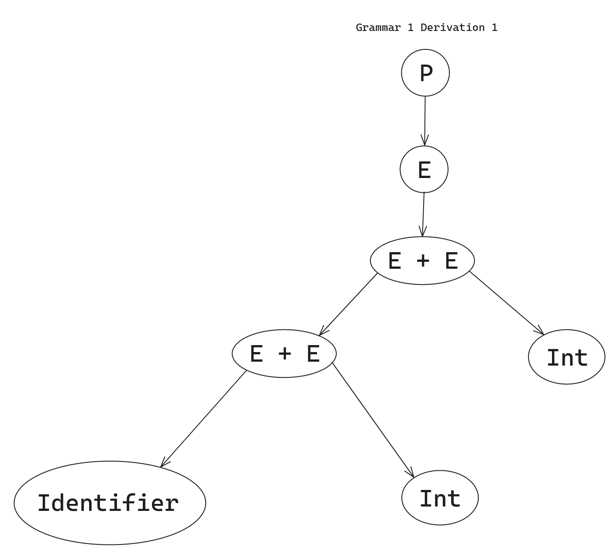
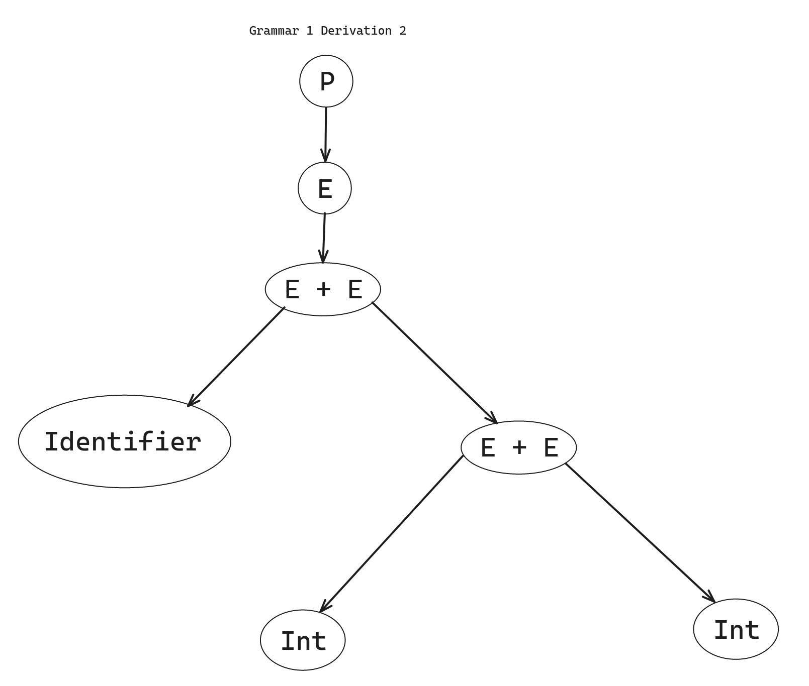
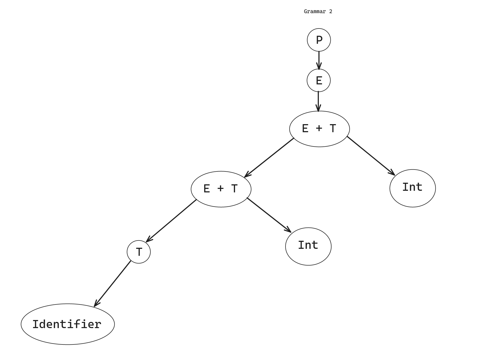
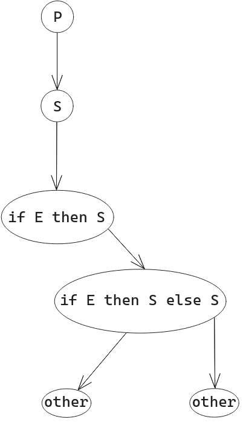

#CFGs

---
## Overview
- CFGs are a list of rules that describe which sentences are valid within our language. 
- On the left hand side;
	- there will always be a single non-terminal
		- declaration
		- statement
		- expression
- On the right hand side;
	- there will always be an expression that describes a valid form the non-terminal will take.
---
## An Example Rule
- We know that a CFG is merely a list of rules. In order to better understand CFGs let us examine the form of one such rule:
	- $A\rightarrow xXy|\in$
- $A$ represents our non-terminal (declaration, statement, or expression)
- $\rightarrow$ is equivalent to "can take the form of"
- $x$ and $y$ are terminal since they are lowercase
- $X$ is non-terminal as it is represented by a uppercase letter
- $|$ is equal to "or" and $\in$ is equivalent to nothing or null.
---
## An Example CFG
- Remember, our first rule is special in that it represents the top level definition of what a valid program is in our language.
	- This is what a abstract CFG looks like:
        - 1.   $P \rightarrow E$
        - 2.   $E \rightarrow E+E$
        - 3.   $E \rightarrow Identifier$
        - 4.   $E \rightarrow Int$
    - There is however a problem with this above CFG. If we look closer at a use case we will see this clearly.
---
## CFG Ambiguity
- Now we will examine what ambiguity is in the context of CFGs and why it is to be avoided.
    - Let us try to parse a sentence using our grammar to see what is going wrong.
        - Our target sentence will be: 
            - $Identifier + Int + Int$
    - We will now apply rules until we reach this sentence as shown below:

- This is wonderful, it shows that the target sentence is a valid one in our language. The only problem is that it is not the only route we can take to get to this understanding.
    - Let us look at another route we could take to get to the 'same' answer:

---
## Why And How To Avoid Ambiguity
- In the above example ambiguity is not too important because we have very few rules. Even so, the above example uses addition which is commonly used for things other that addition between numbers. 
- Often, we like to use the addition sign to denote concatenation between to strings.
    - This leads to blunders like the parser interpreting addition between two integers as the addition between two strings.
        - For example: $10+10$ can be interpreted to equal either $20$ or $1010$ depending on which branch the parser goes down (or up).
    - This problem specifically is rather easy to fix, we need only to tweak our grammar a bit. Look below at our superior grammar.
---
## A Less Ambiguous Grammar
- We can easily fix this by declaring that one side of the expression should be a atomic term, T.
    - This will yield us a grammar that has the same valid sentences as our first grammar, but only allows for the left most derivation, eliminating ambiguity:
        - 1.   $P \rightarrow E$
        - 2.   $E \rightarrow E+T$
        - 3.   $E \rightarrow T$
        - 4.   $T \rightarrow Identifier$
        - 5.   $T \rightarrow Int$
    - Let us run down the parse tree for our previous target sentence with this new grammar:

---
## Parsing Order Of Operations
- If we were to try to add more operators, we wouldn't parse the order of operations correctly as we would only parse from left to right.
    - We can fix this by have multiple levels in our grammar to reflect the order of operations we desire. Here is one such example were we add multiplication to our grammar:
        - 1.    $P \rightarrow E$
        - 2.    $E \rightarrow E+T$
        - 3.    $E \rightarrow T$
        - 4.    $T \rightarrow T*F$
        - 5.    $T \rightarrow F$
        - 6.    $F \rightarrow Identifier$
        - 7.    $F \rightarrow Int$
---
## Parsing Control Structures
- A common use case is parsing control structures like if-then and if-then-else.
    - We can express this with simple grammar, as shown below:
        - 1.    $P \rightarrow S$
        - 2.    $S \rightarrow$ if $E$ then $S$
        - 3.    $S \rightarrow$ if $E$ then $S$ else $S$
        - 4.    $S \rightarrow$ other
    - Of course we have problems with such a simple grammar. One such problem is ambiguity, which we can easily show by finding two valid parse trees for a sentence within our language.
        - Our target sentence will be "if $E$ then if $E$ then other else other".

